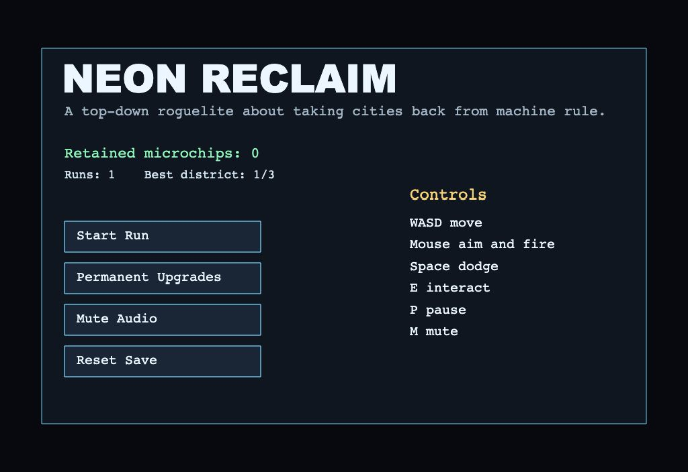
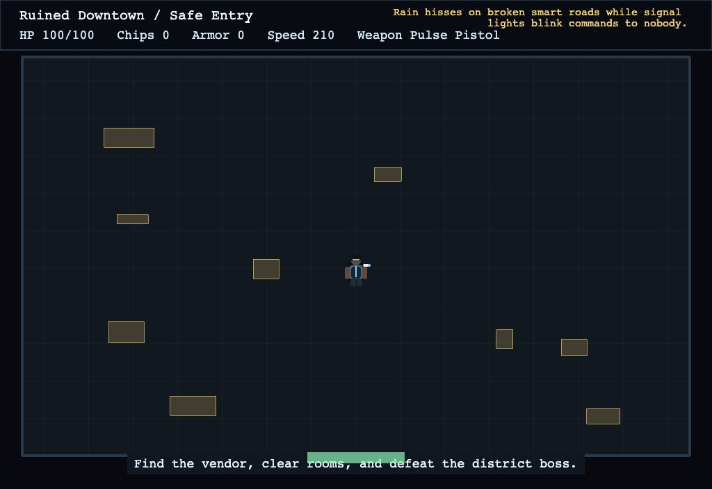

# Neon Reclaim

Neon Reclaim is a browser-based sci-fi dungeon crawler built with Phaser, Vite, and TypeScript. You fight through machine-held city districts, salvage microchips, buy field upgrades, and invest in permanent improvements between runs.

Play Neon Reclaim at [neonreclaim.games.dbren.uk](https://neonreclaim.games.dbren.uk).

## Screenshots

| Main menu                                                 | Gameplay room                                                     |
| --------------------------------------------------------- | ----------------------------------------------------------------- |
|  |  |

## Game Overview

- Explore procedurally generated room graphs across three districts: Ruined Downtown, Abandoned Mall, and the Automated Data Core.
- Fight enemy archetypes with distinct behaviors, including swarmers, shield units, snipers, mine layers, support units, and hackers.
- Collect microchips from cleared rooms and spend them at field vendors during a run.
- Unlock and use weapons including the Pulse Pistol, Rail Rifle, Scatter Coil, and Arc Lancer.
- Defeat district bosses to advance deeper into the city.
- Keep retained microchips between runs and spend them on permanent upgrades.
- Save data is stored locally in the browser through `localStorage`.

## Controls

### Desktop

| Input               | Action                                      |
| ------------------- | ------------------------------------------- |
| `W`, `A`, `S`, `D`  | Move                                        |
| Mouse click         | Aim and fire                                |
| `Space`             | Dodge                                       |
| `E`                 | Interact                                    |
| `P`                 | Pause                                       |
| `M`                 | Mute or unmute audio                        |
| `Esc` / `Backspace` | Leave upgrade, vendor, and settings screens |

### Mobile

Neon Reclaim is designed for landscape play on touch devices.

| Input               | Action                                      |
| ------------------- | ------------------------------------------- |
| Left virtual stick  | Move                                        |
| Right virtual stick | Aim and fire                                |
| Dodge button        | Dodge                                       |
| Use button          | Interact                                    |
| Pause button        | Pause or resume                             |
| Mute button         | Mute or unmute audio                        |
| On-screen buttons   | Leave vendor, upgrade, and settings screens |

## Tech Stack

- [Phaser](https://phaser.io/) for rendering, input, scenes, and arcade physics.
- [Vite](https://vite.dev/) for the development server and production build.
- [TypeScript](https://www.typescriptlang.org/) for strict type checking.
- [Vitest](https://vitest.dev/) for logic tests.
- [ESLint](https://eslint.org/) and [Prettier](https://prettier.io/) for code quality and formatting.

## Development Notes

Development setup, project structure, quality checks, and agent workflow guidance live in [AGENTS.md](./AGENTS.md).

## License

Neon Reclaim is licensed under the GNU General Public License v3.0. See [LICENSE](./LICENSE).

## AI Attribution (AIA)

AIA EAI Hin R Codex (gpt-5.5) v1.0
